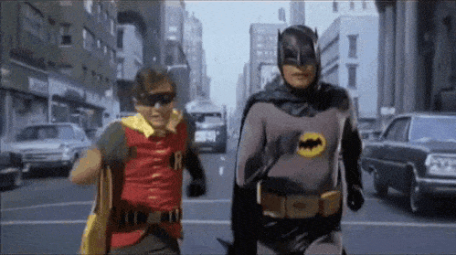

# Holy exclamation [](https://travis-ci.org/terkelg/exclamation)

> Holy here we go again, random Robin exclamation catch-phrases



Robin of the 1960s Batman TV series is noted for his many catch-phrase "Holy..." exclamations.
This is all 367 exclamations in alphabetical order.

## Install

```
$ npm install exclamation
```


## Usage

```JavaScript
const exclamations = require('exclamation');

exclamations.random();
//=> 'Holy Alps'
```


## API

### all

Type: `array`

367 Robin exclamations in alphabetical order.

### random()

Type: `function`

Random Robin exclamations.


## CLI

```
$ npm install --global exclamation
```

```
$ exclamation --help

    Examples
        $ exclamation
            Holy Alps

        $ exclamation --all
            Holy Agility
            Holy Almost
            ...

    Options
        --all   Get all exclamations instead of a random one
```


## License

[MIT License](LICENSE) @ [Terkel Gjervig](https://terkel.com)
